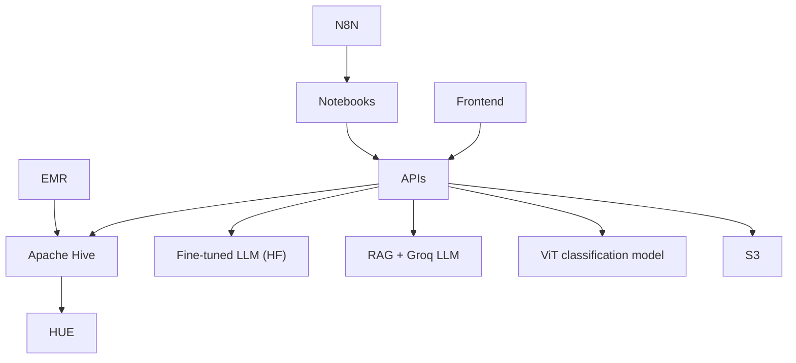

# Gaia 

Gaia is an AI-assisted plant support project with three backend APIs and a web frontend:

-   Plant image recognition (ViT image classification via Hugging Face)
-   Plant care with RAG (FAISS semantic search + Groq LLM for natural-language answers)
-   Plant care with a fine-tuned LLM (Hugging Face causal model per user)
-   Browser frontend that routes all workflows through a single HTTP entrypoint

## Architecture Diagram (Simple)

## Requirements

### Local Development

-   Docker and Docker Compose
-   Make
-   Python 3.12+ (only if running services without Docker)
-   API credentials in `projects/api/.env` (copy from `projects/api/.env.example`)

### Production Deployment (AWS)

-   AWS account and permissions for EC2, VPC, Security Groups, and S3
-   AWS CLI configured locally
-   Terraform
-   Docker Hub images for Gaia services

## Documentation

-   [Documentation index](docs/README.md)
-   [Local development](docs/development/local-development.md)
-   [Plant Recognition API](docs/apis/plant-recognition.md)
-   [Plant Care API (RAG)](docs/apis/plant-care.md)
-   [Plant Care LLM API (fine-tuned)](docs/apis/plant-care-llm.md)
-   [Frontend overview](docs/frontend/overview.md)
-   [Architecture](docs/infrastructure/architecture.md)
-   [AWS deployment with Terraform](docs/infrastructure/deployment-aws.md)
-   [n8n flow docs](docs/n8n/flows.md)
