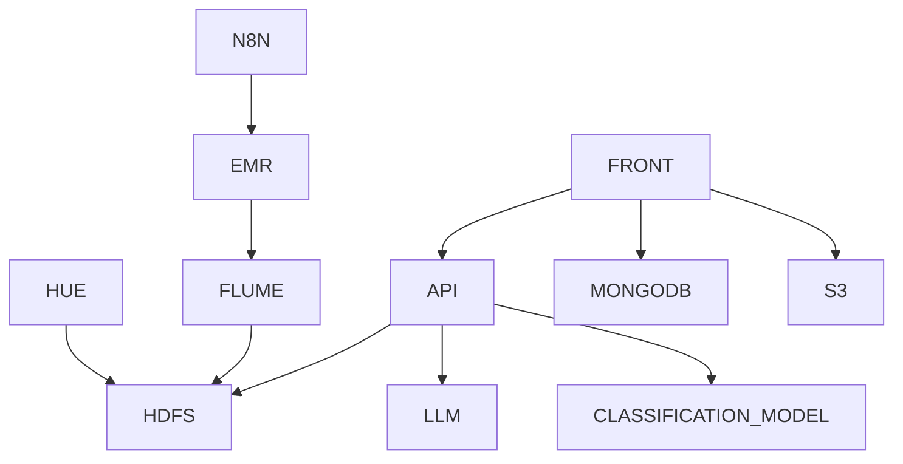

# Gaia

Web application to assist plant caregivers, utilizing AI.

## Architecture Overview

The system is composed of several components, including data scraping, processing, storage, and a frontend for visualization.



For more details, see the [documentation](docs/architecture.md).

## APIs (`projects/api/`)

Las APIs viven bajo `projects/api/` con dos servicios:

-  **`plant_recognition/`** — visión: identificación de planta en una imagen (puerto 5000).
-  **`plant_care/`** — búsqueda semántica sobre el CSV de cuidados (puerto 5001).

Variables de entorno compartidas: copia `projects/api/.env.example` a `projects/api/.env` (por ejemplo `HF_TOKEN`).

## Plant Recognition API

API para reconocimiento de plantas utilizando modelos de visión por computadora.

### Instalación

```bash
cd projects/api/plant_recognition
python -m venv venv
source venv/bin/activate
pip install -r requirements.txt
```

### Ejecución

```bash
python main.py
```

La API estará disponible en `http://localhost:5000`

### Endpoints

#### POST /recognize

Reconoce una imagen de planta y devuelve las 5 predicciones más probables.

**Ejemplo de uso:**

```bash
curl -X POST -F "image=@ruta/imagen.jpg" http://localhost:5000/recognize
```

**Respuesta:**

```json
{
   "predictions": [
      { "plant": "Rosa chinensis", "probability": 0.4521 },
      { "plant": "Rosa canina", "probability": 0.2305 },
      { "plant": "Rosa gallica", "probability": 0.1203 },
      { "plant": "Rosa rugosa", "probability": 0.0892 },
      { "plant": "Rosa multiflora", "probability": 0.0456 }
   ]
}
```

#### GET /health

Verifica que la API esté funcionando.

```bash
curl http://localhost:5000/health
```

### Variables de entorno

En `projects/api/`, copia `.env.example` a `.env` y configura:

-  `HF_TOKEN`: Token de Hugging Face para modelos privados (requerido para modelos gated)

### Requisitos

-  Python 3.12+
-  torch
-  transformers
-  flask
-  Pillow
-  numpy<2

## Plant Care API (búsqueda semántica)

### Instalación

```bash
cd projects/api/plant_care
python -m venv venv
source venv/bin/activate
pip install -r requirements.txt
```

### Ejecución

```bash
python main.py
```

Disponible en `http://localhost:5001`. Endpoints: `GET /health`, `GET /plant?q=...&k=1`, `POST /plant` con JSON `{"query":"...","k":3}`.

Los Dockerfiles de las APIs están en `docker/plant-recognition-api` y `docker/plant-care-api`.

## Stack Docker (tipo producción)

Todo el stack con **imágenes desde Docker Hub** y un **frontend nginx** que hace de proxy (`/api/r` → reconocimiento, `/api/c` → cuidados), así el chat usa el **mismo origen** y evita CORS y bloqueadores.

```bash
make login          # una vez, para pull/push
make up             # pull APIs + build web + http://localhost:8080
make logs
make down
```

Variables útiles: `DOCKERHUB_USER`, `API_TAG`, `WEB_TAG`, `GAIA_HTTP_PORT`. El fichero `projects/api/.env` (opcional) se inyecta en los contenedores de las APIs.

Publicar imágenes propias:

```bash
make push-apis      # build local + push reconocimiento y cuidados
make push-web       # build + push frontend (nginx)
```

Desarrollo **sin** Docker: ejecuta las dos APIs con `python main.py` y abre `projects/frontend/index.html` vía `python -m http.server` en esa carpeta; `api-bases.js` apunta a `127.0.0.1:5000` y `5001`.

## Frontend de prueba (chat)

En `projects/frontend/`: texto → cuidados; imagen → reconocimiento; respuesta JSON en bruto. Con Docker Compose las URLs por defecto pasan por el proxy del propio nginx.
