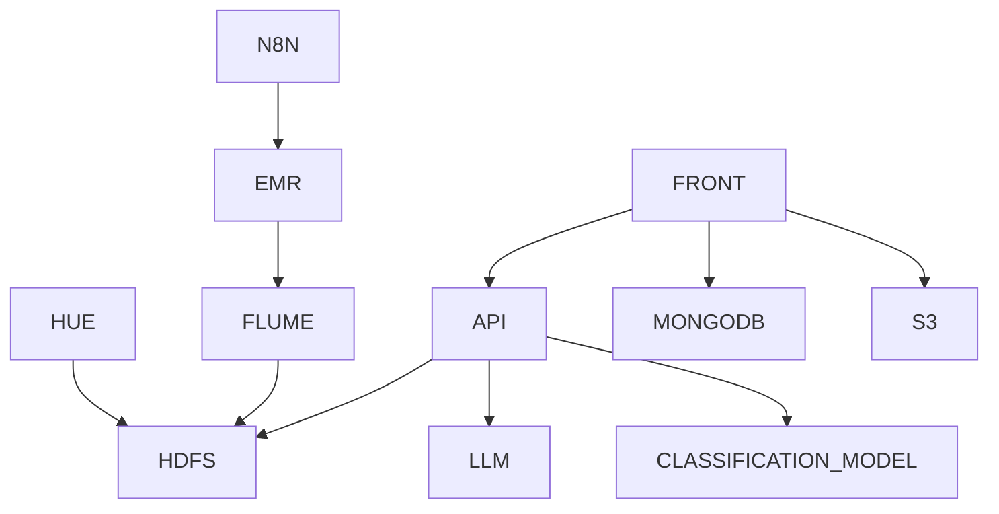

# Gaia 

Gaia is an AI-assisted plant support project with two backend APIs and a web frontend:

-  Plant image recognition (computer vision model inference)
-  Plant care retrieval (semantic search over curated plant data)
-  Browser frontend that routes both workflows through a single HTTP entrypoint

## Architecture Diagram (Simple)

## Requirements

### Local Development

-  Docker and Docker Compose
-  Make
-  Python 3.12+ (only if running services without Docker)
-  API credentials in `projects/api/.env` (copy from `projects/api/.env.example`)

### Production Deployment (AWS)

-  AWS account and permissions for EC2, VPC, Security Groups, and S3
-  AWS CLI configured locally
-  Terraform
-  Docker Hub images for Gaia services

## Documentation

-  [Documentation index](docs/README.md)
-  [Local development](docs/development/local-development.md)
-  [Plant Recognition API](docs/apis/plant-recognition.md)
-  [Plant Care API](docs/apis/plant-care.md)
-  [Frontend overview](docs/frontend/overview.md)
-  [Architecture](docs/infrastructure/architecture.md)
-  [AWS deployment with Terraform](docs/infrastructure/deployment-aws.md)
-  [n8n flow docs](docs/n8n/flows.md)
