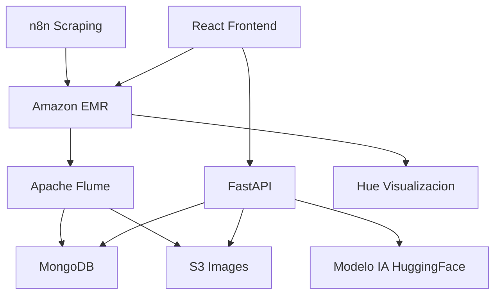

# Gaia

Web application to assist plant caregivers, utilizing AI.

## Architecture Overview

The system is composed of several components, including data scraping, processing, storage, and a frontend for visualization.

For more details, see the [documentation](docs/architecture.md).
