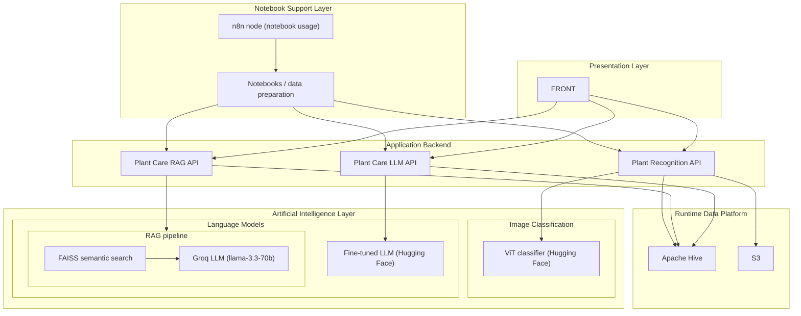

# Documentation Index

Runtime AI stack: **one** image classifier (ViT), **two** LLM paths (fine-tuned Hugging Face model vs. FAISS retrieval + Groq).

## Architecture Diagram (Detailed)

## Development

-   Local development: `docs/development/local-development.md`

## APIs

-   Plant Recognition API: `docs/apis/plant-recognition.md`
-   Plant Care API: `docs/apis/plant-care.md`
-   Plant Care LLM API: `docs/apis/plant-care-llm.md`

## Frontend

-   Frontend overview: `docs/frontend/overview.md`

## Infrastructure

-   Architecture: `docs/infrastructure/architecture.md`
-   AWS deployment with Terraform: `docs/infrastructure/deployment-aws.md`
-   n8n ingestion flow context: `docs/infrastructure/n8n-flow.md`
-   n8n flow documentation: `docs/n8n/flows.md`
