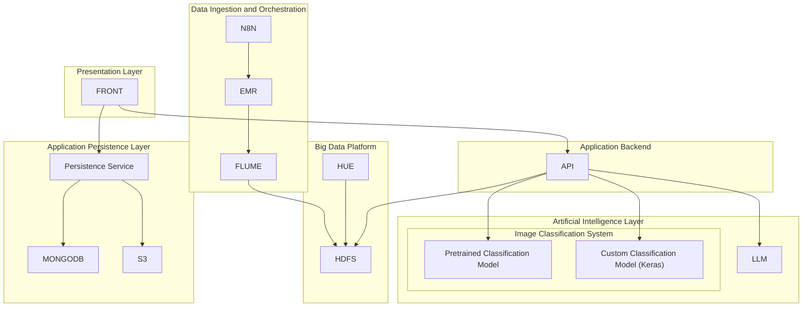

# Documentation Index

## Architecture Diagram (Detailed)

## Development

-  Local development: `docs/development/local-development.md`

## APIs

-  Plant Recognition API: `docs/apis/plant-recognition.md`
-  Plant Care API: `docs/apis/plant-care.md`

## Frontend

-  Frontend overview: `docs/frontend/overview.md`

## Infrastructure

-  Architecture: `docs/infrastructure/architecture.md`
-  AWS deployment with Terraform: `docs/infrastructure/deployment-aws.md`
-  n8n ingestion flow context: `docs/infrastructure/n8n-flow.md`
-  n8n flow documentation: `docs/n8n/flows.md`
