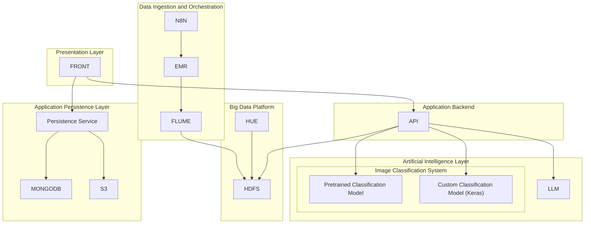

# Gaia Architecture

This document provides a detailed overview of the Gaia system architecture.

## Components

-  **n8n Scraping**: Automates data collection.
-  **Amazon EMR**: Processes large-scale data.
-  **Apache Flume**: Streams data to storage.
-  **HDFS**: Stores large-scale processed and raw data.
-  **Hue**: Data visualization tool for processed data.
-  **FastAPI**: Provides an API for accessing data and models.
-  **Fine-tuned LLM**: Provides natural language processing capabilities via the backend API.
-  **Classification Model**: Performs image classification and exposes inference through the backend API.
-  **React Frontend**: Provides the user interface for interacting with the system.
-  **MongoDB**: Stores structured application data.
-  **S3**: Stores unstructured data such as images and assets.

## Architecture Diagram

