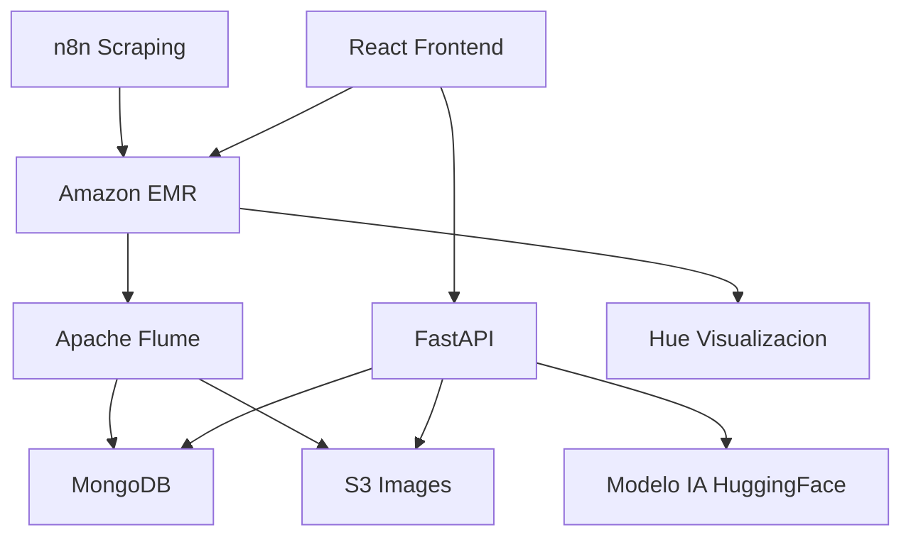

# Gaia Architecture

This document provides a detailed overview of the Gaia system architecture.

## Components

-  **n8n Scraping**: Automates data collection.
-  **Amazon EMR**: Processes large-scale data.
-  **Apache Flume**: Streams data to storage.
-  **MongoDB**: Stores structured data.
-  **S3**: Stores images and other unstructured data.
-  **FastAPI**: Provides an API for accessing data and models.
-  **HuggingFace Model**: AI model for plant care recommendations.
-  **React Frontend**: User interface for visualization.
-  **Hue**: Data visualization tool for processed data.

## Architecture Diagram

