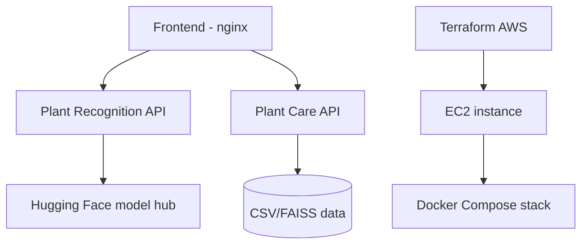

# Gaia Architecture

This document summarizes the current Gaia architecture and runtime layers.

## Main Layers

-  **Data ingestion**: n8n flows to collect external plant data
-  **Application APIs**: Plant Care API and Plant Recognition API
-  **Frontend**: browser client served by nginx
-  **Storage and services**: optional MongoDB and S3 usage via environment flags
-  **Deployment**: local Docker Compose and AWS EC2 (Terraform + Docker Compose)

## Infrastructure References

-  Terraform AWS config: `infra/terraform/`
-  EC2 bootstrap script: `infra/terraform/command.sh`
-  Local stack orchestration: `docker-compose.yml`
-  Build and deploy commands: `Makefile`
-  n8n flow definition: `projects/n8n/getPlantCareData.json`
-  n8n usage notes: `docs/n8n/flows.md`

## Runtime Diagram

