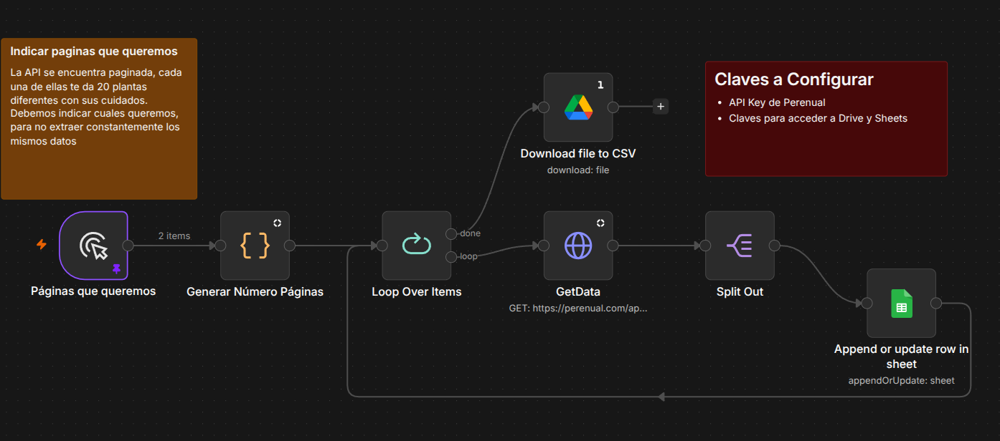

# `getPlantCareData` Flow Documentation

## 1. Flow Purpose

This flow automates the collection of plant data: it selects API pages, retrieves information for each plant, saves it to Google Sheets, and generates a CSV file. It provides an easy and reliable way to maintain an up-to-date dataset for the project.

## Workflow diagram

Import the flow from `projects/n8n/getPlantCareData.json` into your n8n instance (`make n8n-start` from the repo root). The canvas should match the diagram below:

The sticky notes in the workflow remind you to **choose which API pages to fetch** (Perenual returns 20 plants per page) and to configure **Perenual**, **Google Sheets**, and **Google Drive** credentials.

---

## 2. Flow Execution

1. Specify the range of pages to process.
2. Generate the list of pages.
3. Iterate through each page.
4. Retrieve API data and split it by plant.
5. Save plant data in Google Sheets.
6. Download the data as a CSV file.

---

## 3. Requirements

-  Perenual API Key.
-  Google Drive and Google Sheets credentials.
-  n8n running locally or via Docker.
